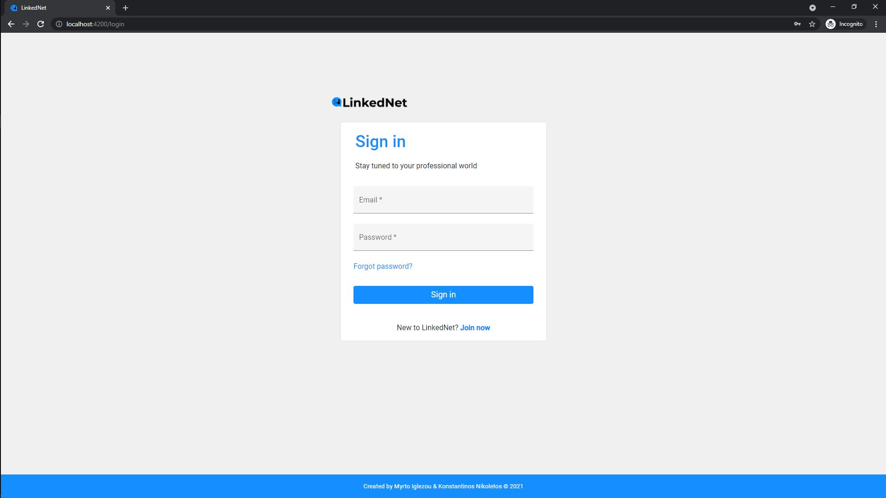
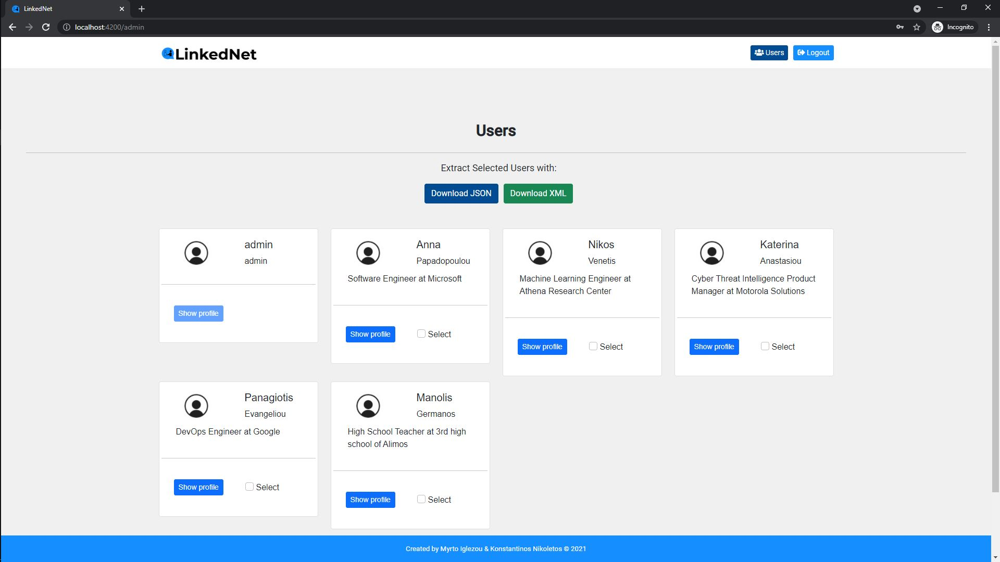
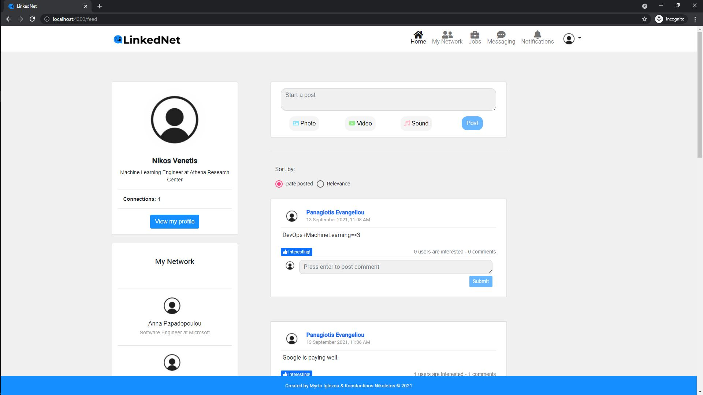
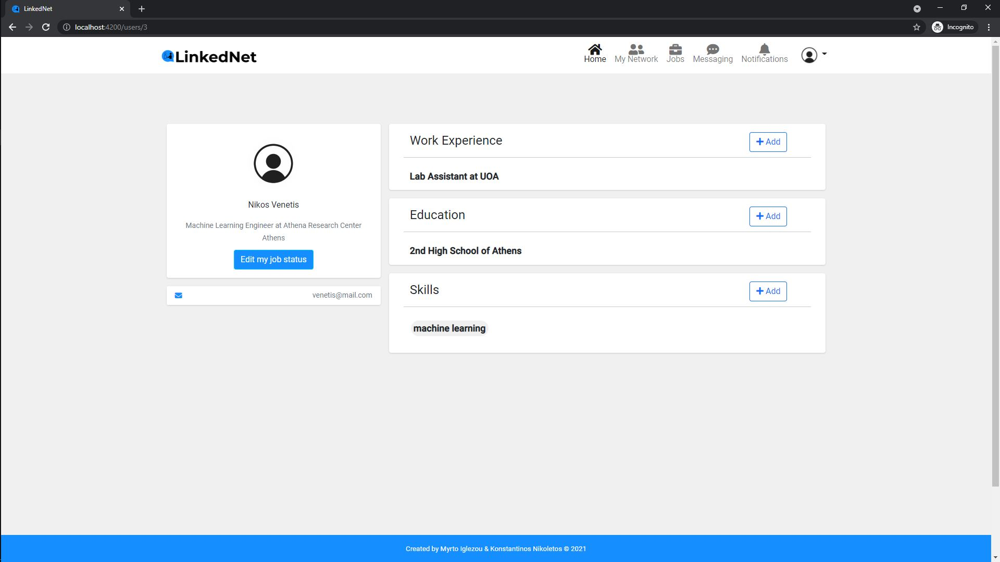
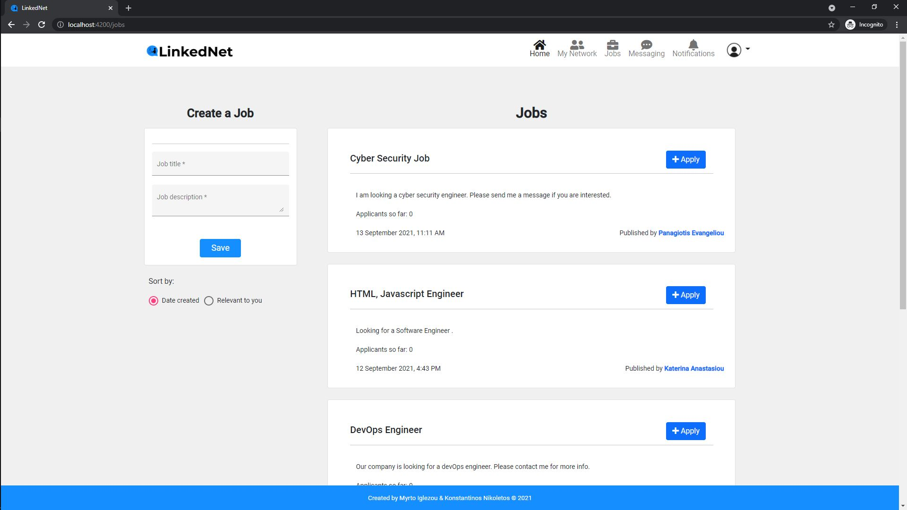
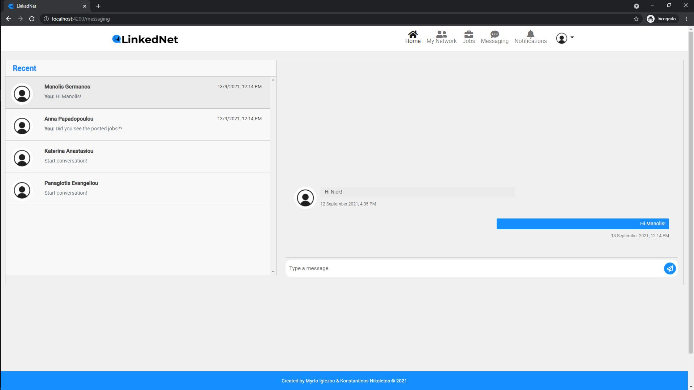
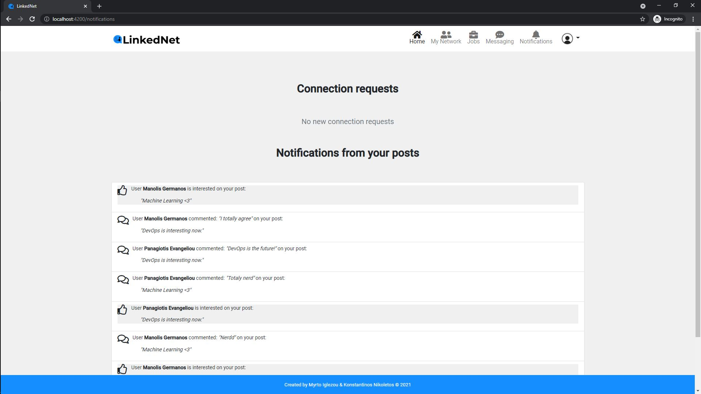

<p>
    <a></a>
    <a></a>
    <a></a>
    <a></a>
    <a></a>
    <a></a>
</p>


---
# LinkedIn-Clone
## Introduction

The goal of this project is to implement a web application, which represents a professional social networking application, similar to LinkedIn. <br>

In the application there are 2 roles: __Administrator__ / __Professional__. The role of administrator is assigned to a specific user / users during the installation of the application. Each role corresponds to a separate graphical user interface through which:
* A) administrators manage the users of the application and export their data, 
* B) professionals manage information about their education and work experience, make requests to connect with other professionals and accept or reject connection requests, review and manage the network of affiliated professionals, post articles that can contain images and videos, post and respond to ads, see in their timeline the articles posted by affiliate professionals having the opportunity to comment on them, note their interest in specific posts and be notified of other users' interest in their posts, have private discussions with their affiliates professionals, navigate the presentation pages of other professionals, manage their login settings. 


## Implementation

When the application starts, the administrator is created (admin).He has access to all the information of other users. These users are professionals, who have the ability to interact with other users, exchanging messages, making friends, responding to friend posts, and more. At the same time, they can create job ads as well as make requests to other users' ads, edit their personal information and ultimately create their own professional network.
SpringBoot and MySQL were used for the back-end implementation, while the Angular framework was used for the front-end.

## Team members

This project made by <a href="https://myrto-iglezou.github.io">Myrto Iglezou</a> and <a href="https://nikoletos-k.github.io">Konstantinos Nikoletos</a>.

# Execution

__Front:__  ```ng serve```  ✅ 

__Back:__   ```JetBrains run``` ☑️

!! SSL/TLS browser security must be disabled for localhost: ```chrome://flags/#allow-insecure-localhost```

## Existed Users

| Username | Password |
| ---- | ---- |
| admin@mail.com | 012345 |
| papadopoulou@mail.com | 12345|
| anastasiou@mail.com | 12345|
| venetis@mail.com | 12345|
| evangeliou@mail.com | 12345|
| germanos@mail.com | 12345|

## Photos of the application

### Login page

  

--- 

### Administrator's page

  

--- 

### Feed page

  

--- 

### Profile page

  

--- 
### Job page

  

--- 

### Profile page

  

--- 

### Chat page

  

--- 

### Notifications page

  

--- 

© Myrto Iglezou && Konstantinos Nikoletos
